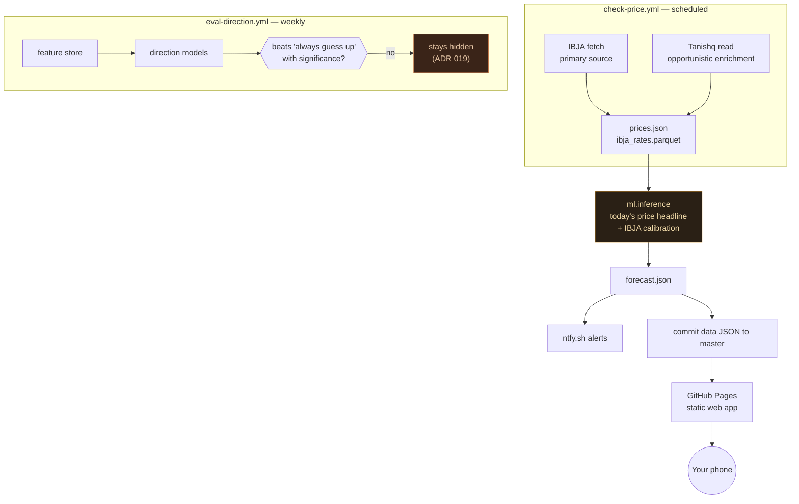

# Gold Rate Tracker

**Buying gold jewellery in India? This page tells you today's 22K gold rate, how fresh that number is, and whether today's price is cheap or expensive compared with the recent past — in plain language, for free, with no ads and no sign-up.**

**Open it:** https://gaurav-gandhi-2411.github.io/gold-rate-tracker/ — works in any phone browser, and can be installed like an app (iPhone: Safari → Share → *Add to Home Screen*; Android: Chrome → *Install app*).

  
  

*Screenshots of the live page. Numbers in them are real production data at capture time, not mocked.*

## What you'll see

- **Today's 22K rate, with a date on it.** The price is based on the rate published by IBJA (the India Bullion and Jewellers Association — India's national bullion benchmark) and upgraded to a directly-read Tanishq rate when that is available. Every price carries a "last updated" label, so you always know how old it is. On days IBJA doesn't publish (weekends, holidays) you see the last published rate, clearly dated — never a stale number pretending to be today's.
- **How fresh the data is.** The data is refreshed automatically several times a day. Over the last <!--METRIC:data/cadence_metrics.json#window_days:int-->7<!--/METRIC--> days, a new price usually came in every <!--METRIC:data/cadence_metrics.json#median_gap_hours:num1|asof=as_of-->4.6 (as of 2026-09-24)<!--/METRIC--> hours. If updates stall, the page shows a warning banner instead of quietly showing an old price.
- **A likely range, not just one number.** Next to the price is a range the real rate usually falls within. It's aimed at being right <!--METRIC:data/calibration_band_coverage.json#nominal_pct:int-->80<!--/METRIC-->% of the time; checked against real IBJA rates, it has actually landed inside the range <!--METRIC:data/calibration_band_coverage.json#coverage:frac10-->about 7 times out of 10<!--/METRIC--> so far — a bit narrower than it should be, so treat it as a guide. We re-check this every week; [How we know](how-we-know.html) has the exact numbers behind both figures.
- **"Is today cheap or expensive?"** A plain-language read of where today's price sits compared with the past few weeks and months — near a recent low, near a recent high, or in between — and whether prices have recently been steadying or still falling. This describes what has already happened.
- **How much prices typically swing** over a few days, so a small daily move doesn't look like a big one.

Want phone alerts when the price moves? They are available if you run your own copy of the project (free, via the [ntfy](https://ntfy.sh) app) — see [For developers](#for-developers).

## What it won't tell you — and why

**No prediction of where the price goes next. No "% chance it rises." No buy or sell advice.**

That's deliberate, not an omission. Every week the project tests whether any model can call the next move better than the simple rule "gold usually goes up, so just guess up". So far none has, with enough evidence to trust it, so the page shows nothing rather than a guess dressed up as insight ([ADR 019](docs/adr/019-direction-signal-below-base-rate.md), [ADR 020](docs/adr/020-supersede-015-consensus-degenerate.md)). Even if a model someday passes that test, it still cannot appear on the page without a separate, explicit human sign-off ([ADR 036](docs/adr/036-direction-signal-promotion-gate.md)).

The latest weekly results, updated automatically:

| Question | Honest answer | Source |
|---|---|---|
| Can any model call tomorrow's direction? | **No, at either timeframe tested.** Next day: <!--METRIC:data/direction_baseline.json#horizons.h1.logistic_metrics.accuracy:pct1|n=horizons.h1.n_test_folds|asof=generated_at_utc-->49.0% (n=153, as of 2026-09-24)<!--/METRIC--> right vs. <!--METRIC:data/direction_baseline.json#horizons.h1.logistic_metrics.always_up_accuracy:pct1-->51.0%<!--/METRIC--> for "always guess up". Two days out: <!--METRIC:data/direction_baseline.json#horizons.h2.logistic_metrics.accuracy:pct1|n=horizons.h2.n_test_folds|asof=generated_at_utc-->55.1% (n=147, as of 2026-09-24)<!--/METRIC--> vs. <!--METRIC:data/direction_baseline.json#horizons.h2.logistic_metrics.always_up_accuracy:pct1-->58.5%<!--/METRIC-->. Neither difference is statistically significant (two days out: p=<!--METRIC:data/direction_baseline.json#horizons.h2.logistic_metrics.p_value:num2-->0.42<!--/METRIC-->). Neither is shown. | [`docs/DIRECTION_SIGNAL_STATUS.md`](docs/DIRECTION_SIGNAL_STATUS.md) |
| Does the price forecast beat "just use today's price"? | **No.** <!--FROZEN reason="SHA-pinned point-in-time citation, backtest.json @ ad42160 -- must not drift with live data"-->Naive flat-hold: ₹249/g avg error. Chronos-Bolt-Tiny: ₹292/g avg error — **17% worse**, over 209 walk-forward folds (p≈0).<!--/FROZEN--> So the page shows today's price as the headline, not a forecast. | `data/backtest.json` @ [`ad42160`](https://github.com/gaurav-gandhi-2411/gold-rate-tracker/blob/ad4216086d10a63bb93ed3107c9ccee429cb5fa0/data/backtest.json) |
| Is the headline's own "likely range" well-calibrated? | **Not yet known either way.** Since a July 2026 fix ([ADR 022](docs/adr/022-conformal-pi-horizon-fix.md)), it has contained the real price <!--METRIC:data/coverage_metrics.json#coverage:pct1|n=n|ci=wilson_ci_low,wilson_ci_high|asof=generated_at_utc|unresolved_if=resolvable_at_n-->73.0% (n=63, 95% CI [61.0%, 82.4%], as of 2026-09-20) — not yet resolvable at this sample size<!--/METRIC--> of the time against a <!--METRIC:data/coverage_metrics.json#nominal_pct:int-->80<!--/METRIC-->% target — too few days yet to say whether it's well-sized. | `data/coverage_metrics.json` |

## How it works

No server, no database, no paid API. A scheduled GitHub Actions job fetches the IBJA rate (and tries Tanishq), works out the calibrated estimate and range, and commits the results as small JSON files; GitHub Pages serves a static web app that reads them. It costs nothing to run.

- **Where the price comes from ([ADR 025](docs/adr/025-ibja-primary-source-decision.md)).** IBJA is the primary source: it publishes a daily benchmark reliably. Tanishq's site is harder to read automatically — over the last <!--METRIC:data/tanishq_scrape_success_rate.json#window_days:int-->7<!--/METRIC--> days a direct read succeeded <!--METRIC:data/tanishq_scrape_success_rate.json#success_rate:pct1|n=n|asof=generated_at_utc-->90.9% (n=33, as of 2026-09-24)<!--/METRIC--> of the time — so it only ever upgrades the IBJA-based estimate, never replaces it.
- **How the estimate is made.** Retail 22K prices track the IBJA rate very closely (fit R²=<!--METRIC:data/calibration.json#r_squared:num2|n=n_observations|asof=fit_date-->0.97 (n=85, as of 2026-09-11)<!--/METRIC-->), so the page converts IBJA's rate into an estimated retail rate, and its range comes from how far past estimates actually missed ([ADR 027](docs/adr/027-calibration-oos-validation-recency-weighting.md)).
- **The page itself** is plain HTML + JavaScript that reads those JSON files directly. No accounts, no ads, no analytics. Beyond GitHub itself, it loads its chart library from a public CDN (jsDelivr) and uses an error tracker (Sentry) that reports crashes in the page so they can be fixed.

Full page, top to bottom (click to expand)

## For developers

**Run your own copy** (fork, set your own ntfy topic, enable Pages), **alert setup**, and **troubleshooting**: see [docs/RUNBOOK.md → Running your own copy](docs/RUNBOOK.md#running-your-own-copy). Operating this deployment (rollback, CI debugging, staleness response, scraper and runner ops): [docs/RUNBOOK.md](docs/RUNBOOK.md). System design: [docs/ARCHITECTURE.md](docs/ARCHITECTURE.md). Audit history: [docs/SESSION_AUDIT_2026-08.md](docs/SESSION_AUDIT_2026-08.md).

| Path | What |
|------|------|
| `index.html`, `app.js`, `service-worker.js` | The web app (what users see) |
| `scraper/` | Tanishq read (Node; a plain-HTTP path is tried first but is blocked by Cloudflare — it has succeeded <!--METRIC:data/tanishq_scrape_success_rate.json#n_requests_path:int-->0<!--/METRIC--> of <!--METRIC:data/tanishq_scrape_success_rate.json#n:int|asof=generated_at_utc-->33 (as of 2026-09-24)<!--/METRIC--> attempts in the rolling window, so the Playwright path is what actually runs) |
| `ml/` | Inference, calibration, notifications, the direction-eval harness |
| `data/` | Committed price/forecast/eval JSON the web app reads |
| `.github/workflows/` | `check-price.yml` (scheduled data refresh), `lint.yml`, `eval-direction.yml`, `weekly-backtest.yml`, `scraper-canary.yml` |
| `docs/` | RUNBOOK, ARCHITECTURE, ADRs, CURRENT_STATE, DIRECTION_SIGNAL_STATUS |

Every number in this README is injected from `data/*.json` by `scripts/inject_metrics.py` and re-checked in CI (`docs-freshness`), so it can't silently go stale — never type one by hand.

### Design decisions (ADRs)

- [ADR 005](docs/adr/005-honest-baseline-reporting.md) — always report when the model loses to the simple baseline
- [ADR 012](docs/adr/012-naive-headline-chronos-companion.md) — today's price as the headline; the Chronos model only as a hidden companion
- [ADR 019](docs/adr/019-direction-signal-below-base-rate.md) — the direction signal doesn't beat the base rate; ship nothing
- [ADR 025](docs/adr/025-ibja-primary-source-decision.md) — IBJA primary, Tanishq opportunistic enrichment
- [ADR 036](docs/adr/036-direction-signal-promotion-gate.md) — no direction signal reaches users without an explicit, human-approved promotion record

### AI/LLM usage

Built and maintained with heavy use of Claude Code — architecture decisions, ADRs, the ML pipeline, the web app, and CI are all human-directed but substantially AI-implemented. Documented here rather than hidden: every non-trivial design choice has a linked ADR explaining the *why*, written and kept current regardless of who typed the diff.

## License

[MIT](LICENSE)
