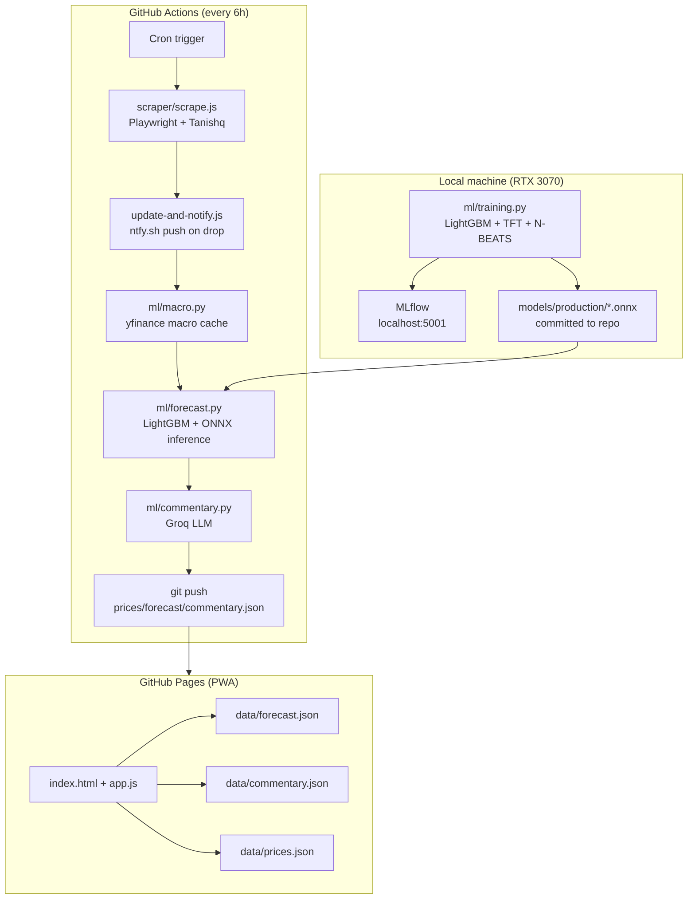

# Gold Rate Tracker

[](https://github.com/gaurav-gandhi-2411/gold-rate-tracker/actions/workflows/check-price.yml)
[](https://github.com/gaurav-gandhi-2411/gold-rate-tracker/actions/workflows/lint.yml)
[](LICENSE)
[](https://www.python.org/downloads/)
[](https://nodejs.org/)

A free, open-source app that scrapes the [Tanishq gold rate page](https://www.tanishq.co.in/gold-rate.html?lang=en_IN) every 6 hours, charts the trend, pushes a phone notification when the **22K** rate **drops by ₹100 or more**, and forecasts the next reading with an ML ensemble.

- **Frontend:** Progressive Web App (installs to iOS & Android home screen)
- **Backend:** GitHub Actions cron job (free)
- **Storage:** JSON files in this repo
- **Notifications:** [ntfy.sh](https://ntfy.sh) — free, no account needed
- **Hosting:** GitHub Pages (free)
- **ML:** LightGBM + N-BEATS + TFT ensemble (LightGBM retrains in CI; neural models trained locally on RTX 3070, served via ONNX)
- **LLM:** Groq — llama-3.3-70b-versatile, free tier
- **Tracking:** MLflow (local Docker, port 5001)
- **Cost:** ₹0

## Architecture



See [docs/ARCHITECTURE.md](docs/ARCHITECTURE.md) for component descriptions and data flow.

## Local development

MLflow tracks all training runs locally. The stack runs in Docker.

```bash
docker compose up -d        # Start MLflow (port 5001)
docker compose ps           # Verify container is healthy
docker compose logs -f mlflow  # Tail logs
docker compose down         # Stop
```

**MLflow UI at http://localhost:5001.** Backend is SQLite (`mlflow-db/mlflow.db`), artifacts on local volume (`mlruns/`). Both are gitignored.

> **Port note:** Port 5001 avoids conflicts with other local MLflow instances. Override with `MLFLOW_TRACKING_URI=http://localhost:5000 docker compose up -d` if needed.

**Retrain models:**
```powershell
.\scripts\win\mlflow-up.ps1        # Ensure MLflow is running
.\scripts\win\setup-train.ps1      # Create training venv (first time)
venv-train\Scripts\Activate.ps1
python -m ml.training              # Train all models; logs to MLflow
```

See [docs/RUNBOOK.md](docs/RUNBOOK.md) for rollback, feature addition, and CI debugging procedures.

## How tracking works

Every local training run is logged to MLflow at `http://localhost:5001` under experiment `gold-rate-training`. Each run records:

- Hyperparameters (learning rate, architecture dims, early stopping patience)
- Metrics per epoch (train loss, val loss, val MAE in rupees)
- The ONNX file path and size
- Whether the model beats the naive baseline
- Git SHA of the code that produced it

After training, a champion/challenger comparison runs on a 90-day holdout. If the new model is ≥ 2% better on MAE, its ONNX file is promoted to `models/production/` and committed. CI picks it up on the next cron tick.

*[Screenshot placeholder — will be added after Phase D's first production training run.]*

## ML approach

The forecaster predicts the *delta* of the next 22K reading. Differenced targets are more stationary than price levels, which makes the learning problem more tractable on small datasets.

### Models

| Model | Trained | Inference | Features |
|---|---|---|---|
| LightGBM | CI (every scrape) | Direct (< 1 s) | 19 base + 24 macro + 1 regime = 44 features |
| TFT | Local GPU | ONNX (onnxruntime) | Past deltas + macro covariates + calendar future covariates |
| N-BEATS | Local GPU | ONNX (onnxruntime) | Past deltas only (generic architecture) |

### Features

| Feature | Description |
|---|---|
| `lag_1..4` | Price at previous 1–4 readings |
| `lag_7d`, `lag_30d` | Price at the reading closest to 7 and 30 days ago |
| `roll_7d_mean/std/min/max` | 7-day rolling stats (time-based window) |
| `dow`, `hour`, `dom`, `month` | Calendar features |
| `akshaya_tritiya`, `dhanteras` | Binary flag: within ±3 days of festival |
| `since_last_drop` | Readings since last ≥₹100 price drop |
| `prev_delta` | Price change from the previous reading |
| `gold_usd`, `usd_inr`, `us_10y_yield`, `dxy`, `sensex`, `vix_level` | Daily macro levels |
| `usd_inr_lag_1..7`, `gold_usd_lag_1..7` | 1–7 day lags of key macro rates |
| `regime` | HMM state: 0=low-vol, 1=high-vol |

**Target:** `price[t+1] − price[t]`

### Performance (honest)

<!-- BACKTEST_STATS_START -->
> **Model performance (90-day walk-forward backtest, 58 folds on seed data)** — run `python ml/backtest.py` to refresh.
>
> | Metric | LightGBM | Naive baseline |
> |---|---|---|
> | MAE | Rs. 283 | Rs. 204 |
> | MAPE | 1.87% | 1.35% |
> | Direction accuracy | 48.3% | 0.0% |
>
> The naive baseline ("predict no change") beats the model on MAE — expected on a near-random-walk series with fewer than 500 training points. The model's advantage is directional: 48.3% direction accuracy versus 0% for the baseline (which always predicts flat). See [ADR 005](docs/adr/005-honest-baseline-reporting.md) for why we report this honestly.
<!-- BACKTEST_STATS_END -->

## LLM commentary

After each forecast run, `ml/commentary.py` calls the [Groq](https://groq.com) API (`llama-3.3-70b-versatile`, free tier) with the latest prices, 3/7-day deltas, percentile within 90 days, and the forecast. The model is instructed to write 2–3 sentences of plain factual English — no buy/sell advice, no hype. Result stored in `data/commentary.json` (rolling 30 entries).

## Data sources

### Calibration note

The cold-start seed data (444 daily entries) is derived from Yahoo Finance gold spot (GC=F) converted to INR/g and then to 22K/18K via standard karat ratios. Indian retail prices from sources like Tanishq carry a premium over international spot due to import duty (15%), GST (3%), and dealer margins.

The seed values are internally consistent for *modeling price changes* but offset in absolute terms (~5–10%) from Tanishq actuals. The forecast carries a `warmup` flag until ~14 days of real Tanishq scrapes accumulate.

### What's real and what's seeded

| Data | Status |
|---|---|
| Live 22K/24K/18K readings | **Real** — scraped from Tanishq every 6h |
| `data/history_seed.json` | **Estimated** — from Yahoo Finance GC=F × INR=X with retail markup |

## Design decisions

Five Architecture Decision Records document the key choices:

- [ADR 001](docs/adr/001-local-train-ci-inference.md) — Train locally, serve via ONNX in CI
- [ADR 002](docs/adr/002-no-dagster.md) — No Dagster: Python scripts + Makefile is right-sized
- [ADR 003](docs/adr/003-champion-challenger-2pct-threshold.md) — 2% MAE gate for model promotion
- [ADR 004](docs/adr/004-mlflow-local-not-hosted.md) — Local MLflow vs DagsHub/W&B
- [ADR 005](docs/adr/005-honest-baseline-reporting.md) — Always report when the model loses to naive

## Setup (≈15 minutes)

### 1. Create the repo

1. Go to [github.com/new](https://github.com/new), make a new **public** repo. Name suggestion: `gold-rate-tracker`.
2. Upload all files. Easiest path: on your new repo's empty page, click **uploading an existing file**, drag the folder contents in. Commit.

### 2. Pick your ntfy topic

Topics on ntfy.sh are public — treat the topic like a password. Pick something unguessable, e.g. `gold-gaurav-7k2x9p4r`.

### 3. Add secrets

In your repo: **Settings → Secrets and variables → Actions → New repository secret**.

- `NTFY_TOPIC` = your topic name (no URL prefix)
- `GROQ_API_KEY` = your Groq API key from [console.groq.com](https://console.groq.com) (free tier)

### 4. Seed historical data (first time only)

```
pip install -r ml/requirements.txt
python ml/seed_history.py
```

Commit `data/history_seed.json`.

### 5. Trigger the workflow once manually

**Actions → Check Gold Price → Run workflow.** Wait ~2 minutes.

### 6. Enable GitHub Pages

**Settings → Pages → Source: Deploy from a branch → main → / (root) → Save.**

### 7. Subscribe on your phone

Install the **ntfy** app → **+** → enter your topic → Subscribe.

### 8. Install the PWA

- **iOS Safari:** open Pages URL → Share → Add to Home Screen.
- **Android Chrome:** open Pages URL → Install app.

## Tweaking

| What | Where |
|---|---|
| Cron schedule | `.github/workflows/check-price.yml` → `cron:` |
| Drop threshold | same file → `DROP_THRESHOLD` env var |
| Chart default range | `app.js` → `renderChart(allReadings, "7")` |
| Model hyperparams | `configs/model/{lightgbm,tft,nbeats}.yaml` |
| MLflow tracking URI | `MLFLOW_TRACKING_URI` env var (default `http://localhost:5001`) |

## Troubleshooting

- **Scraper fails with "Could not find goldpurity-rate element":** Tanishq changed page structure. Find the new element in the `=== PAGE TEXT ===` dump and update `scraper/scrape.js`.
- **No notifications:** check `NTFY_TOPIC` has no URL prefix, you subscribed to the exact topic, and price actually dropped ≥₹100.
- **Chart is empty:** wait for ≥2 readings, or trigger workflow manually.
- **Forecast missing:** check the "Run forecast" step in Actions logs. It's `continue-on-error: true` so scraping still works.
- **Commentary missing:** ensure `GROQ_API_KEY` secret is set.

## License

[MIT](LICENSE) — do whatever you like with it.
