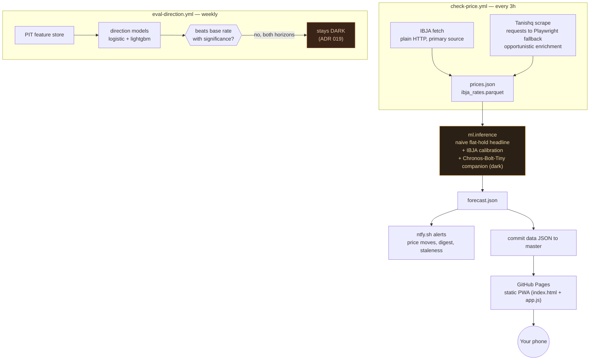

# Gold Rate Tracker

A free, **₹0/month** gold-price tracker for Indian retail buyers (22K), built to answer one question honestly: *is today a good time to buy?* No server, no database, no paid API — GitHub Actions scrapes and models the price every 3 hours, GitHub Pages serves a static PWA that reads the committed JSON. The whole stack costs nothing to run and has run unattended since 2026-05.

**Live site:** https://gaurav-gandhi-2411.github.io/gold-rate-tracker/

  
  

*Live screenshots, 2026-08-06 — price/verdict/trend numbers shown are real production data at capture time, not mocked.*

## The 30-second version

- Shows today's 22K gold price with an honest, dated freshness label — never a bare number pretending to be more certain than it is.
- Tells you in plain language whether today is cheap, expensive, or in between, and whether that cheapness is stabilizing or still falling — grounded in three independent reads of the same price history (30-day percentile, trend-residual, distance to the 3-month low), not one metric dressed up three ways.
- **Refuses to predict tomorrow's direction.** We test next-day and 2-day direction models every week against the honest baseline ("gold usually rises, so just guess up"). None has beaten it with statistical significance — see [Honest results](#honest-results--what-actually-shipped-and-what-didnt) below — so no "% chance up," no buy/sell call, ever.
- Costs nothing: GitHub Actions (compute) + GitHub Pages (hosting) + ntfy.sh (push notifications), all free tiers, forever.

## How it works

- **IBJA-primary, Tanishq-enrichment ([ADR 025](docs/adr/025-ibja-primary-source-decision.md)).** IBJA (India's national bullion-association benchmark) isn't Cloudflare-protected and reliably publishes a daily reading; Tanishq's site now blocks automated access most of the time. The displayed price defaults to an IBJA-calibrated estimate (R²=0.96) and upgrades to a directly-confirmed Tanishq reading only when that scrape succeeds within the last 8h — never the reverse. On IBJA's non-publishing days (weekends, holidays) the page carries forward the last published close, clearly dated. The user never sees a dead price.
- **Static PWA, no server.** `index.html` + `app.js` fetch `data/*.json` straight from the repo and render price, verdict, sparkline, and chart client-side.
- **Direction signal stays dark by design**, not by omission — see below.

Full page, top to bottom (click to expand)

## Honest results — what actually shipped, and what didn't

This project reports the model's numbers *next to* the honest baseline's every time, win or lose — see [ADR 005](docs/adr/005-honest-baseline-reporting.md). Two things shipped; one deliberately didn't.

| Question | Honest answer | Source |
|---|---|---|
| Does the ML forecast beat "just use today's price"? | **No.** Naive flat-hold: ₹249/g avg error. Chronos-Bolt-Tiny: ₹292/g avg error — **17% worse**, over 209 walk-forward folds (p≈0). The naive baseline *is* the production headline. | `data/backtest.json` @ [`ad42160`](https://github.com/gaurav-gandhi-2411/gold-rate-tracker/blob/ad4216086d10a63bb93ed3107c9ccee429cb5fa0/data/backtest.json) |
| Can any model call tomorrow's direction? | **No, at either horizon we test.** h=1: 48.5% accuracy vs. a 50.8% base rate (worse than guessing "up"). h=2: 60.9% vs. a 57.8% base rate — better-looking, but not statistically significant (p=0.45) over 128 folds. Neither ships. | [`docs/DIRECTION_SIGNAL_STATUS.md`](docs/DIRECTION_SIGNAL_STATUS.md), auto-updated weekly |
| Is the "likely range" band well-calibrated? | **Not yet confirmed either way.** Nominal 80% coverage is currently reading 97.3% (n=75) — but that number is honestly flagged as pre-recalibration-dominated (the band's horizon was corrected in July 2026, [ADR 022](docs/adr/022-conformal-pi-horizon-fix.md)/[023](docs/adr/023-correct-adr022-validation-claim.md)); a clean read needs more post-fix decisions to resolve. | `data/coverage_metrics.json` |

The direction signal's own gate logic — both a **probability gate** (calibrated "% up") and a stricter **timing gate** (buy/wait/sell) — requires beating the base rate with significance (p<0.05) *and* a calibration bar (ECE≤0.10) before anything ships. Both are open-source and re-evaluated automatically every Monday; see [`ml/direction/gate.py`](ml/direction/gate.py). This is the gate working as designed, not a stalled feature.

## What it actually claims (and what it doesn't)

- ✅ **Today's price** — IBJA-calibrated by default, upgraded to a directly-confirmed Tanishq reading when the live scrape succeeds — always with an honest, dated freshness label.
- ✅ A **5-day volatility range** ("prices have typically swung ±X over 5 days") — descriptive, not a forecast.
- ✅ A plain-language **"is it a good time to buy?"** read, grounded in the recent 7-day trend, 30-day percentile position, trend-residual, and distance to the 3-month low — a description of what already happened, never a prediction.
- ❌ **No price prediction. No "% chance up." No buy/sell call.** See [Honest results](#honest-results--what-actually-shipped-and-what-didnt) above for exactly why, with the numbers.

## Notifications (bring your own ntfy topic)

Alerts are delivered via [ntfy.sh](https://ntfy.sh) — free, no account. **Pick your own topic and keep it private:** anyone who knows a topic name can publish to it, so treat it like a password (a long random string, e.g. `gold-<yourname>-<16 random chars>`). Set it as the `NTFY_TOPIC` GitHub Actions secret and subscribe to it in the ntfy app.

Alert types: a price-move alert (describes the recent trend), a twice-daily digest, and a data-staleness warning if scraping stalls. All copy is plain-language and ASCII-safe.

## Setup (~15 minutes)

1. Fork / create a public repo and upload all files.
2. **Settings → Secrets and variables → Actions → New repository secret:**
   - `NTFY_TOPIC` — your OWN ntfy.sh topic (treat like a password; long & random).
3. **Actions → Check Gold Price → Run workflow** (manual trigger; wait ~2 min).
4. **Settings → Pages → Deploy from branch → `master` → `/` (root).**
5. Install the PWA: iOS Safari → Share → Add to Home Screen · Android Chrome → Install app.
6. Subscribe to alerts: install the ntfy app → **+** → enter your topic.

## Repo layout

| Path | What |
|------|------|
| `index.html`, `app.js`, `service-worker.js` | The PWA (what users see) |
| `scraper/` | Tanishq scrape (Node, requests-first with Playwright fallback) |
| `ml/` | Inference, calibration, notifications, the direction-eval harness |
| `data/` | Committed price/forecast/eval JSON the PWA reads |
| `.github/workflows/` | `check-price.yml` (3h loop), `lint.yml`, `eval-direction.yml`, `scraper-canary.yml` |
| `docs/` | RUNBOOK, ADRs, CURRENT_STATE, DIRECTION_SIGNAL_STATUS |

## Troubleshooting

- **Prices look stale:** the page banner will say so, honestly labeled either way. A Tanishq scrape miss alone is expected (its Cloudflare block, [ADR 025](docs/adr/025-ibja-primary-source-decision.md)) and logged as a run annotation, not a hard failure — check the latest **Check Gold Price** run in Actions. An actual alert (ntfy T9/T9_ESCALATE) only fires when *IBJA* itself hasn't published in 2+ business days — that's the genuine failure signal.
- **No notifications:** confirm `NTFY_TOPIC` has no URL prefix, you subscribed to the *exact* topic, and a price move actually occurred.
- **Scraper DOM canary issue opened:** the canary now distinguishes a Cloudflare block (logged as a warning, no alert — expected steady state) from a real DOM/selector break (alerts + opens an issue) automatically. See [docs/RUNBOOK.md](docs/RUNBOOK.md) if one still fires.

## Design decisions (ADRs)

- [ADR 005](docs/adr/005-honest-baseline-reporting.md) — always report when the model loses to naive
- [ADR 012](docs/adr/012-naive-headline-chronos-companion.md) — naive flat-hold headline, Chronos as a (dark) companion
- [ADR 019](docs/adr/019-direction-signal-below-base-rate.md) — the direction signal doesn't beat the base rate; ship nothing
- [ADR 025](docs/adr/025-ibja-primary-source-decision.md) — IBJA primary, Tanishq opportunistic enrichment
- [docs/RUNBOOK.md](docs/RUNBOOK.md) — rollback, CI debugging, staleness

## AI/LLM usage

Built and maintained with heavy use of Claude Code — architecture decisions, ADRs, the ML pipeline, the PWA, and CI are all human-directed but substantially AI-implemented. Documented here rather than hidden: every non-trivial design choice above has a linked ADR explaining the *why*, written and kept current regardless of who typed the diff.

## License

[MIT](LICENSE)
