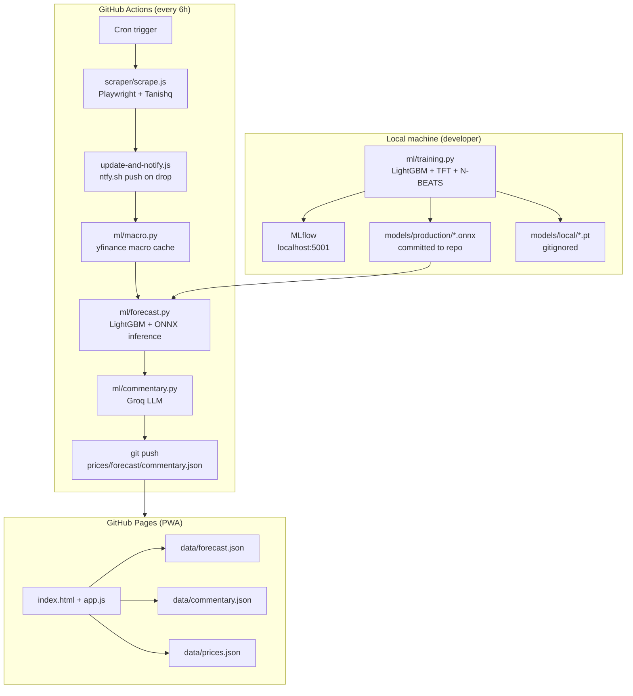

# Architecture

## System overview



## Component descriptions

### Scraper (`scraper/`)
Playwright-based Node.js scraper that navigates Tanishq's gold rate page and extracts 22K/24K/18K prices. Runs in GitHub Actions every 6 hours. On a drop of ≥ ₹100, sends an ntfy.sh push notification. Output appended to `data/prices.json`.

### Macro features (`ml/macro.py`)
Downloads daily macro data (gold spot GC=F, USD/INR, 10Y yield, DXY, Sensex, VIX) from yfinance with retry logic. Caches to `data/macro_cache.parquet` (gitignored). Falls back gracefully if yfinance is unavailable.

### Regime detection (`ml/regime.py`)
Gaussian HMM (2 states, hmmlearn) fitted on log-returns of macro features. Labels each trading day as `low-vol` (state 0) or `high-vol` (state 1). State labels added as a feature for LightGBM. Current regime written to `data/regime.json`.

### Forecast (`ml/forecast.py`)
Trains LightGBM (mean + 10th/90th quantile) on combined seed + scraped history. At inference, loads ONNX models for TFT and N-BEATS. Ensemble weights are inverse-MAE from a rolling holdout. Writes `data/forecast.json`.

### Training (`ml/training.py`)
Orchestrates full training pipeline: data load → feature engineering → regime fit → LightGBM train → TFT train → N-BEATS train → ensemble weight compute → champion/challenger compare → ONNX promotion. All runs logged to MLflow (experiment: `gold-rate-training`).

### MLflow (`docker-compose.yml`)
Local-only tracking server on port 5001 (SQLite backend, local artifact volume). Logs hyperparams, metrics, ONNX paths, and git SHA for every training run. Not used in CI.

### Hydra configs (`configs/`)
Composable YAML configs for data, model, training, inference, and tracking. Override on command line: `python -m ml.training model=lightgbm`. Config snapshot logged to MLflow with each run.

### PWA (`index.html`, `app.js`, `service-worker.js`)
Progressive Web App served from GitHub Pages. Reads `data/*.json` directly from the repo. Installable on iOS and Android home screen.

## Data flow

```
Tanishq page
  → prices.json (scraped, committed every 6h)
  → history_seed.json (bootstrapped from Yahoo Finance, one-time)
  → load_combined_history() (merge + deduplicate + calibrate)
  → build_feature_matrix() (19 base + 24 macro + 1 regime features)
  → LightGBM / TFT ONNX / N-BEATS ONNX → ensemble prediction
  → forecast.json (next-day 22K point estimate + 80% interval)
  → commentary.json (Groq LLM market note)
  → PWA
```

## Key constraints

| Constraint | Reason |
|---|---|
| ONNX for CI inference | CI venv has no PyTorch; onnxruntime is enough |
| Local MLflow only | No hosted MLflow account; local Docker is free and sufficient |
| LightGBM retrains every run | Data volume is small; no stale-model risk |
| Neural models trained locally | RTX 3070 available; GitHub Actions CPU too slow for TFT |
| No Dagster/Airflow | Right-sized for a single univariate series (see ADR 002) |
