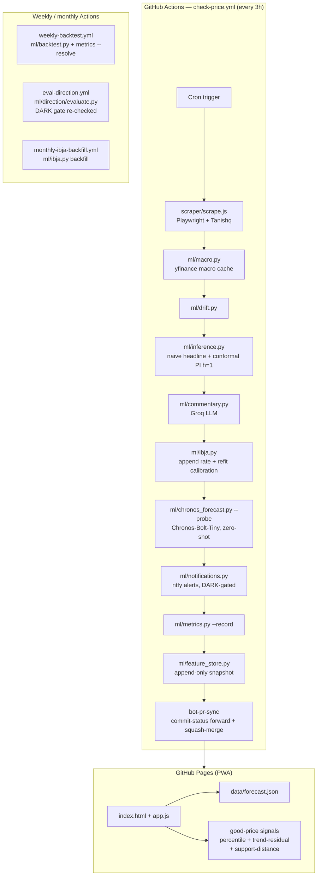

# Architecture

*Last verified against the running code 2026-07-18.*

## System overview



## Component descriptions

### Scraper (`scraper/scrape.js`, `scraper/update-and-notify.js`)
Playwright-based Node.js scraper that navigates Tanishq's gold rate page and extracts 22K/24K/18K prices. On a drop ≥ ₹100, sends an ntfy.sh push notification. Output appended to `data/prices.json`.

### Macro features (`ml/macro.py`)
Downloads daily macro data (gold spot GC=F, USD/INR, 10Y yield, DXY, Sensex, VIX) from yfinance with retry logic. Caches to `data/macro_cache.parquet` (gitignored). Falls back gracefully if yfinance is unavailable. Feeds `ml/drift.py` and the direction dataset, not the price forecast itself (the naive headline needs no features; Chronos is univariate).

### Inference (`ml/inference.py`)
The production forecast orchestrator, run once per cycle. In order: reads the latest `prices.json` reading for the current price; computes the displayed conformal prediction interval at `horizon_idx=0` (h=1, next trading day — see ADR 022/023 below) from the last 30 `backtest.json` folds, and a separate h=5 interval purely to floor `ml/volatility.py`'s realized-vol estimate; applies the IBJA current-price fallback if the Tanishq scrape is stale (see ADR 021 below); builds the **naive headline** (`predicted_22k = current price` — a flat-hold forecast, ADR 012); reads (never computes) the Chronos-directional companion block from `data/chronos_probe.json`; calls `ml/drivers.py` for driver attribution (non-blocking — a failure here never breaks inference); writes `data/forecast.json`.

**Ordering note:** this step runs *before* the IBJA-append, calibration-refit, and Chronos-probe steps later in the same cycle (`check-price.yml`), so each cycle's `forecast.json` reads `chronos_probe.json`/`calibration.json` as they stood at the *end of the previous* cycle, not values refreshed this cycle. Observed directly from step order, not a documented design decision.

### Forecast engine — Chronos (`ml/chronos_forecast.py`)
`amazon/chronos-bolt-tiny`, pinned revision, loaded **zero-shot via `from_pretrained`** — there is no training step for the price forecast. `run_probe()` (the CI entry point, `python -m ml.chronos_forecast --probe`) loads the IBJA daily series, produces a p10/p50/p90 5-day-ahead quantile forecast (single deterministic call, not multi-sampled — ADR 020), classifies a lean direction, optionally applies the IBJA→Tanishq calibration, and always writes `data/chronos_probe.json` — even on failure, with a `status` field (`insufficient_context` / `model_load_failed` / `forecast_failed` / `success`) so downstream consumers can tell degraded from healthy. This module writes exclusively to `chronos_probe.json`; it never touches `forecast.json` directly — `ml/inference.py` reads the probe and folds it in as a secondary "lean" companion alongside the naive headline.

### Direction classifier (`ml/direction/{gate.py, models.py, dataset.py, evaluate.py}`)
A separately-evaluated directional signal, gated behind two statistical checks (`ml/direction/gate.py`): a probability gate (≥30 walk-forward folds, statistically significant vs. always-predict-up, better Brier score and accuracy than the naive baseline, ECE ≤ 0.10) and a stricter timing gate on top of it. Neither currently passes — this is the **DARK** state referenced elsewhere in this repo's docs/UI: not a literal status field written anywhere, but the honest, documented outcome of the gate. Run weekly (`eval-direction.yml`) via `ml/direction/evaluate.py`, which walk-forward evaluates logistic regression, LightGBM, and a persistence baseline for h=1 and h=2, and writes `data/direction_baseline.json` + `data/direction_eval_history.jsonl`. The PWA does not read this file — the frontend's "Off — not yet reliable" copy (`app.js::renderMethodology`) is a manually-written reflection of the gate's current outcome, not a live runtime read.

### Conformal prediction interval (`ml/inference.py::_compute_conformal_pi`)
Per [ADR 022](adr/022-conformal-pi-horizon-fix.md), the displayed band uses **h=1** (next trading day) — matching what `ml/metrics.py`'s coverage check actually measures — rather than the earlier h=5 framing, cutting the displayed band width roughly in half. [ADR 023](adr/023-correct-adr022-validation-claim.md) is a follow-up correction to ADR 022's own validation claim: because the backtest fit window and the live-decision check window nearly fully overlap, the 84.7% coverage figure cited there is a retrospective sanity check, not independent out-of-sample evidence — `data/coverage_metrics.json`'s prospective post-2026-07-17 track is the eventual genuine OOS evidence. No code changed for ADR 023; it corrects a claim, not a computation.

### IBJA↔Tanishq calibration (`ml/calibration.py`, `ml/ibja.py`)
`ml/calibration.py::fit_calibration` fits a `HuberRegressor` (robust to lag-artefact outliers) mapping IBJA's per-gram rate to Tanishq's 22K retail price — a scale/offset calibration, not a full premium model, requiring ≥30 overlapping days before it's trusted. Auto-refits every 10 new pairs. Per [ADR 021](adr/021-h5-ibja-fallback.md), when the Tanishq scrape is stale (>8h — the same threshold as the UI stale banner) and a fresh IBJA reading exists, `ml/inference.py` substitutes an IBJA-calibrated current-price estimate (with an uncertainty band) rather than showing a dead-stale Tanishq number. `ml/ibja.py` fetches daily AM/PM rates from ibjarates.com each cycle and separately supports a monthly 30-day PDF backfill (`monthly-ibja-backfill.yml`).

### Good-price descriptive signals (`app.js`)
Three deterministic, purely descriptive supporting lines under the "is today a good price?" card — none of them forecast or recommend:
- `computeGoodPriceSignals` — today's price percentile within the last 30 days, four-tier verdict (cheap / below-mid / mid / high).
- `computeTrendResidual30d` — a Theil-Sen trend fit over the last 30 days; how far today sits from that trend, distinguishing "cheap and still falling" from "cheap and stabilizing."
- `computeSupportDistance90d` — distance from the trailing 90-day low, added 2026-07-18 after confirming it isn't redundant with the trend-residual (r≈0.48 correlation on real history) — catches the case where the trend-residual alone can't tell "falling but mid-range" from "falling and sitting on the 90-day floor."

### PWA (`index.html`, `app.js`, `service-worker.js`)
Progressive Web App served from GitHub Pages, scoped by `_config.yml` to just the app surface (see the repo/deploy cleanup, 2026-07-18). Reads `data/*.json` directly. Two independent freshness guards: a UI-facing stale banner (`app.js::renderStaleBanner`, 8h scrape-age threshold, falls back to the IBJA-calibrated estimate before declaring genuine staleness) and a CI-facing `scraper-canary.yml` (weekly + on scraper-path PRs) that runs a live scrape against the real Tanishq page to catch DOM/selector breakage before it reaches production.

### Bot-PR merge flow (`.github/actions/bot-pr-sync`)
Every scheduled workflow above writes data and pushes via this composite action rather than pushing to `master` directly (branch protection). It force-pushes to a reused bot branch, resolves the PR by number (not branch name, to avoid picking up a stale merged PR), explicitly dispatches `lint.yml` (a `GITHUB_TOKEN`-authored PR doesn't auto-trigger `pull_request` workflows), polls for both required checks to go green, then merges with a real-user PAT (branch protection blocks `github-actions[bot]`'s own merge even with green checks).

## Retired components

These were part of the pre-Phase-3 architecture (last live 2026-05-19, replaced by [ADR 014](adr/014-production-architecture.md) / PR #29, 2026-05-20). Kept here as historical record — none of this runs today:

| Component | What it was | Why retired |
|---|---|---|
| `ml/forecast.py`, `ml/training/train_lgbm.py`, `ml/models/lgbm.py` | LightGBM (mean + p10/p90 quantile) trained on scraped + Yahoo-seeded history, ensembled with ONNX TFT/N-BEATS | Naive headline (ADR 012) matched or beat it on walk-forward MAE with far less complexity and no training-drift risk |
| `ml/regime.py` | Gaussian HMM regime detector, feature for LightGBM | Zero splits in any LightGBM model — confirmed dead weight (`docs/FEATURE_INVENTORY.md`) before the model itself was retired |
| `ml/daily_summary.py` | Standalone trigger-based ntfy notification system | Superseded by `ml/notifications.py`'s Chronos-directional-signal triggers |
| `ml/ensemble.py`, `ml/promotion.py`, `ml/compare_feature_sets.py` | Champion/challenger ONNX promotion pipeline | No longer applicable — Chronos is a fixed pretrained model, not trained/promoted per run |
| MLflow (`docker-compose.yml`'s `mlflow` service, `ml/tracking.py`) | Local experiment tracking for LightGBM/TFT/N-BEATS training runs | Removed in [ADR 024](adr/024-remove-mlflow-hydra-scaffolding.md) — zero production callers, and `mlflow` was never in any requirements file (uninstallable in CI regardless) |
| Hydra configs (`ml/config.py`, `configs/`) | Composable YAML config loader for the training pipeline | Removed in [ADR 024](adr/024-remove-mlflow-hydra-scaffolding.md) — zero production callers, and had been silently broken for two months (its default config referenced `configs/model/ensemble.yaml`, itself deleted in PR #29) |

## Data flow

```
Tanishq page ──(scrape, every 3h)──► prices.json
ibjarates.com ──(fetch, every 3h + monthly PDF backfill)──► ibja_rates.parquet ──► calibration.json (HuberRegressor refit)
yfinance ──► macro_cache.parquet / macro_status.json

prices.json + backtest.json (h=1 conformal PI) + calibration.json + chronos_probe.json[prior cycle]
  ──► ml/inference.py ──► forecast.json (naive headline + Chronos companion + IBJA fallback)
  ──► ml/commentary.py (Groq LLM) ──► commentary.json
  ──► ml/chronos_forecast.py --probe (Chronos-Bolt-Tiny, zero-shot) ──► chronos_probe.json
  ──► ml/notifications.py (DARK-gated triggers) ──► ntfy push + notification_state.json
  ──► ml/metrics.py --record ──► metrics_history.json
  ──► ml/feature_store.py ──► feature_store/snapshots.parquet

weekly:  ml/backtest.py ──► backtest.json;  ml/metrics.py --resolve ──► metrics_history.json, coverage_metrics.json
weekly:  ml/direction/evaluate.py (DARK gate re-checked) ──► direction_baseline.json, direction_eval_history.jsonl

forecast.json + commentary.json + prices.json + backtest.json + coverage_metrics.json
  ──► app.js (PWA) ──► good-price signals (percentile, trend-residual, support-distance), stale banner, methodology card
```

## Key constraints

| Constraint | Reason |
|---|---|
| Chronos-Bolt-Tiny, zero-shot | No training step for the price forecast; CPU-runnable, ~10s model-deserialization dominated cost per cycle (ADR 015) |
| Naive headline as the primary forecast | Matched/beat LightGBM on walk-forward MAE; honest-baseline norm (ADR 005) — the baseline IS the model when it wins |
| Direction signal gated behind statistical checks, currently DARK | Neither gate clears; shipping an ungated directional claim would misrepresent confidence the model doesn't have |
| Conformal PI at h=1 | Matches what's actually validated (ADR 022) — the displayed band and the coverage check must agree on horizon |
| IBJA calibration only after ≥30 overlap days | Fewer points make the `HuberRegressor` fit unstable; the fallback price would carry unstated uncertainty |
| GitHub Pages scoped via `_config.yml` | Legacy Jekyll build serves the whole repo by default — internal docs/ML source had no reason to be reachable at the app's own URL |
| No Dagster/Airflow | Right-sized for a single univariate series (ADR 002) |
